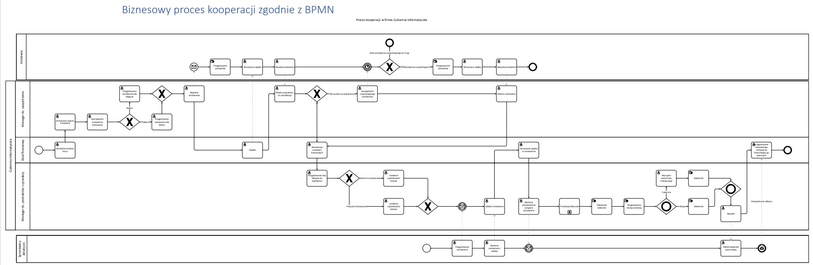

# Business_Intelligence
* Wybrane elementy modelowania procesów biznesowych

Autor: Damian Okoń
---
# Biznesowy proces kooperacji
* Dotyczy procesu współpracy przedsiębiorstwa wytwarzającego wyroby cukiernicze z hurtownią i dostawcą detalicznym 

* Uczestnicy: 
• Cukiernia
• Hurtownia cukiernicza
• Sklepy detaliczne
* Wykonawcy:
• Manager ds. zaopatrzenia
• Manager ds. sprzedaży
• Księgowy

# Biznesowy proces prywatny
* Dotyczy procesu produkcji i serwowania wyrobów cukierniczych w jednym przedsiębiorstwie

Wykonawcy: 
• Pomocnik kuchenny
• Wyrobnik ciasta
• Wyrobnik śmietany
• Menager ds. jakości 
• Kelner

# Diagramy UML
*  Przedstawiają opis działania systemu fast foodu

# Tablica decyzyjna

* Jest odpowiednikiem grafu drzewa decyzyjnego. Przedstawia w graficzny sposób proces decyzyjny, który odnosi się do 
problemu podziału wynagrodzeń dla pracowników firmy informatycznej tworzącej strony 
internetowe.

